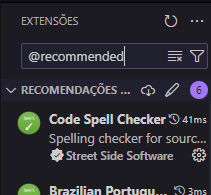

# The BuildBox Javascript Settings

As a developer entrusted with transforming dreams into reality, maintaining a commitment to quality across projects is paramount. This guide is designed to facilitate a seamless transition for any team member working on different projects by providing comprehensive instructions on setting up and configuring the JavaScript environment within Visual Studio Code.

## 1. Setup Visual Studio Code

### Extensions

Begin by establishing your working environment. If the `.vscode` folder includes the `extensions.json` file, Visual Studio Code will prompt the installation of recommended extensions. Alternatively, you can search for recommended extensions using the "@recommended" filter in the Extensions tab.




If the project lacks the `.vscode\extensions.json` file, search for extensions by their IDs. The list of IDs is available in `.vscode\extensions.json` in the same repository.

### Settings

After installing the extensions, it's crucial to configure them correctly for optimal IDE functionality. The file `.vscode\settings.json` contains the necessary configurations. You can either copy this file into your project, maintaining the folder structure, or incorporate the settings into your personal VS Code configuration by pressing Ctrl + Shift + P and searching for "settings.json."

### Fonts

For an enhanced user experience, consider using either [Cascadia Code](https://github.com/microsoft/cascadia-code) or [Fira Code](https://github.com/tonsky/FiraCode) fonts, both featuring ligatures that significantly improve engagement and aesthetics.

## 2. Projects

With your IDE configured, you can now delve into your projects. Certain files in this repository start with ".", and these files should be in the root of all projects to maintain a consistent code standard.

- The `.editorconfig` file preserves common IDE settings.
- The `.eslintrc.json` and `.prettierrc` files maintain standards for indentation and rules in our code. Include these files in the root of your new project to ensure consistency in settings and code style.

Additionally, the `.vscode` folder contains important configurations for your project, including extensions and settings.

### Configurations in the Root

To maintain a standardized code structure, make sure to include the following files in the root of your new project:

- `.editorconfig` for common IDE settings.
- `.eslintrc.json` and `.prettierrc` for code indentation and style rules.

## 3. Dependencies

After configuring your IDE and setting up your project, install the necessary dependencies for everything to work. Run either of the following commands:

```bash
yarn add -D @rocketseat/eslint-config @typescript-eslint/eslint-plugin @typescript-eslint/parser eslint eslint-plugin-react-hooks eslint-plugin-unused-imports prettier typescript
```

or 

```bash
npm install @rocketseat/eslint-config @typescript-eslint/eslint-plugin @typescript-eslint/parser eslint eslint-plugin-react-hooks eslint-plugin-unused-imports prettier typescript --save-dev
```

## Contributions
<a href='https://github.com/LeonardoWlopes'>
	
</a>
<a href='https://github.com/Brunohes'>
	
</a>